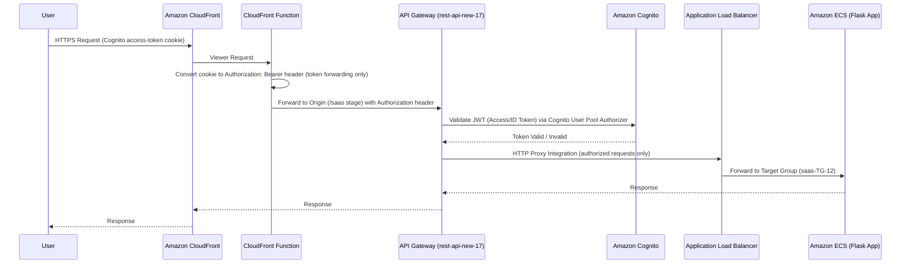

# 🚪 Amazon API Gateway

## 📌 Overview

Amazon API Gateway is a fully managed service that lets you create, publish, and secure REST, HTTP, and WebSocket APIs at any scale. It sits at the edge of your architecture, handling request routing, authorization, throttling, and monitoring so that backend compute services don't have to.

In this project, Amazon API Gateway is deployed as a **REST API** named `rest-api-new-17`, acting as the secure, centralized entry point for every client request entering the Secure Multi-Tenant SaaS Platform.

---

## 🎯 Purpose in THIS Project

| Attribute | Value |
|---|---|
| API Name | `rest-api-new-17` |
| API ID | `26qdafcfw9` |
| API Type | REST API |
| Endpoint Type | Regional |
| Stage | `saas` |
| Invoke URL | `https://26qdafcfw9.execute-api.us-east-1.amazonaws.com/saas` |
| Authorization | Amazon Cognito User Pool Authorizer (JWT) |
| Authorizer Name | `cognito-authorizer-06` |
| Authorizer Type | Cognito User Pool Authorizer |
| Token Source | `Authorization` header |
| Token Validation | `None` (optional JWT claim-matching regex field on the authorizer — unused; does **not** mean JWT authorization is disabled. The Cognito User Pool Authorizer still validates the JWT signature/issuer/expiry against JWKS and enforces the required authorization scope per method) |
| Integration Type | HTTP Proxy Integration (Application Load Balancer) |
| Logging | Amazon CloudWatch Logs |
| Throttling | Default Stage Throttling (No Custom Throttling Configured) |
| Caching | Disabled |
| Status | Available |

`rest-api-new-17` receives every application request routed through Amazon CloudFront, validates the caller's identity using a Cognito JWT authorizer, and proxies the authenticated request to the Application Load Balancer over HTTP.

---

## ✅ Why This Service Was Selected

- The platform required a **single, versioned, and centrally managed entry point** for all Flask application routes instead of exposing the Application Load Balancer directly to the internet.
- API Gateway's native **Amazon Cognito User Pool Authorizer** integration made it possible to enforce JWT validation at API Gateway, before any request reaches Amazon ECS.
- **HTTP Proxy Integration** allowed the existing Flask routing logic to be reused without rewriting the application as a set of Lambda-backed API Gateway methods.
- Built-in **Amazon CloudWatch Logs** integration provided request-level visibility without deploying a separate logging layer.
- Regional endpoint type kept latency low for the CloudFront origin while avoiding the added complexity of an edge-optimized deployment.

---

## ⚙️ My Implementation

### REST API Resource Tree

```
/                                   [GET]
├── /api
│   └── /v1
│       ├── /admin
│       │   ├── /dashboard          [GET]
│       │   └── /users              [POST]
│       │       └── /{user_id}
│       │           ├── /delete     [POST]
│       │           └── /toggle     [POST]
│       ├── /billing
│       │   ├── /invoices           [GET]
│       │   └── /usage              [GET]
│       ├── /health                 [GET]
│       ├── /password
│       │   └── /reset              [POST]
│       └── /users
│           ├── /dashboard          [GET]
│           ├── /password-reset     [GET, POST]
│           └── /userdetails        [POST]
├── /auth
│   └── /callback                   [GET]
├── /billing                        [GET]
├── /login                          [GET]
│   └── /cognito                    [GET]
├── /logout                         [GET, POST]
├── /manage-users                   [GET]
├── /password
│   └── /reset                      [GET]
├── /static
│   └── /{proxy+}                   [ANY]
└── /users
    ├── /details                    [GET]
    └── /password-reset             [GET, POST]
```

> This tree reflects the actual configured REST API structure exactly as deployed and supersedes any earlier, smaller resource tree previously documented here.

### Resource → Method-Level Authorization Detail

Every configured method is documented below exactly as implemented. `Authorization: NONE` methods are public; `Authorization: cognito-authorizer-06` methods require a valid Cognito-issued JWT access token carrying the listed authorization scope, forwarded as an `Authorization: Bearer` header by the CloudFront Function (see [09-CloudFront-README.md](09-CloudFront-README.md)). All Endpoint URLs below share the ALB DNS prefix `saas-ALB-12-654507458.us-east-1.elb.amazonaws.com` (shown as `...` after row 1).

| # | Resource | Method | Authorization | API Key Required | Authorization Scopes | Integration Type | Endpoint URL | URL Path Parameters | Request Paths |
|---|---|---|---|---|---|---|---|---|---|
| 1 | `/` | GET | NONE | false | None | HTTP Proxy | `saas-ALB-12-654507458.us-east-1.elb.amazonaws.com/` | None | None |
| 2 | `/api/v1/admin/dashboard` | GET | `cognito-authorizer-06` | false | `saas-api/read` | HTTP Proxy | `.../api/v1/admin/dashboard` | None | None |
| 3 | `/api/v1/admin/users` | POST | `cognito-authorizer-06` | false | `saas-api/write` | HTTP Proxy | `.../api/v1/admin/users` | None | None |
| 4 | `/api/v1/admin/users/{user_id}/delete` | POST | `cognito-authorizer-06` | false | `saas-api/write` | HTTP Proxy | `.../api/v1/admin/users/{user_id}/delete` | `user_id` | `method.request.path.user_id` → `integration.request.path.user_id` |
| 5 | `/api/v1/admin/users/{user_id}/toggle` | POST | `cognito-authorizer-06` | false | `saas-api/write` | HTTP Proxy | `.../api/v1/admin/users/{user_id}/toggle` | `user_id` | `method.request.path.user_id` → `integration.request.path.user_id` |
| 6 | `/api/v1/billing/invoices` | GET | `cognito-authorizer-06` | false | `saas-api/read` | HTTP Proxy | `.../api/v1/billing/invoices` | None | None |
| 7 | `/api/v1/billing/usage` | GET | `cognito-authorizer-06` | false | `saas-api/read` | HTTP Proxy | `.../api/v1/billing/usage` | None | None |
| 8 | `/api/v1/health` | GET | NONE | false | None | HTTP Proxy | `.../api/v1/health` | None | None |
| 9 | `/api/v1/password/reset` | POST | `cognito-authorizer-06` | false | `saas-api/write` | HTTP Proxy | `.../api/v1/password/reset` | None | None |
| 10 | `/api/v1/users/dashboard` | GET | `cognito-authorizer-06` | false | `saas-api/read` | HTTP Proxy | `.../api/v1/users/dashboard` | None | None |
| 11 | `/api/v1/users/password-reset` | GET | `cognito-authorizer-06` | false | `saas-api/read` | HTTP Proxy | `.../api/v1/users/password-reset` | None | None |
| 12 | `/api/v1/users/password-reset` | POST | `cognito-authorizer-06` | false | `saas-api/write` | HTTP Proxy | `.../api/v1/users/password-reset` | None | None |
| 13 | `/api/v1/users/userdetails` | POST | `cognito-authorizer-06` | false | `saas-api/write` | HTTP Proxy | `.../api/v1/users/userdetails` | None | None |
| 14 | `/auth/callback` | GET | NONE | false | None | HTTP Proxy | `.../auth/callback` | None | None |
| 15 | `/billing` | GET | `cognito-authorizer-06` | false | `saas-api/read` | HTTP Proxy | `.../billing` | None | None |
| 16 | `/login` | GET | NONE | false | None | HTTP Proxy | `.../login` | None | None |
| 17 | `/login/cognito` | GET | NONE | false | None | HTTP Proxy | `.../login/cognito` | None | None |
| 18 | `/logout` | GET | NONE | false | None | HTTP Proxy | `.../logout` | None | None |
| 19 | `/logout` | POST | NONE | false | None | HTTP Proxy | `.../logout` | None | None |
| 20 | `/manage-users` | GET | `cognito-authorizer-06` | false | `saas-api/read` | HTTP Proxy | `.../manage-users` | None | None |
| 21 | `/password/reset` | GET | NONE | false | None | HTTP Proxy | `.../password/reset` | None | None |
| 22 | `/static/{proxy+}` | ANY | NONE | false | None | HTTP Proxy | `.../static/{proxy}` | `proxy` | `method.request.path.proxy` → `integration.request.path.proxy` |
| 23 | `/users/details` | GET | `cognito-authorizer-06` | false | `saas-api/read` | HTTP Proxy | `.../users/details` | None | None |
| 24 | `/users/password-reset` | GET | `cognito-authorizer-06` | false | `saas-api-read` | HTTP Proxy | `.../users/password-reset` | None | None |
| 25 | `/users/password-reset` | POST | `cognito-authorizer-06` | false | `saas-api/write` | HTTP Proxy | `.../users/password-reset` | None | None |

> ⚠️ **Configuration Finding — Method #24 (`/users/password-reset` GET):** The currently documented/configured method scope is `saas-api-read` (hyphen), while every other read-protected method uses `saas-api/read` (slash), matching the Cognito Resource Server's actual scope format (`saas-api`, custom scope `read` → `saas-api/read`). This is reproduced above exactly as configured — the value has **not** been silently changed. The API Gateway console should be verified and this method corrected to `saas-api/read` if that is the intended scope.

Every method integrates with the backend through **HTTP Proxy Integration**, forwarding the request path, headers, and body directly to `saas-ALB-12`, which then routes it to the Amazon ECS Fargate task.

---

## 🔄 Role in End-to-End Request Flow



API Gateway is the **primary JWT authentication and API-scope authorization boundary** in the request path — the CloudFront Function only forwards the token (it does not validate it), and only requests carrying a valid Cognito-issued JWT with the required scope are proxied onward to the ALB and Amazon ECS.

---

## 🔗 Communication With Other AWS Services

| Service | Interaction |
|---|---|
| **Amazon CloudFront** | Origin domain for `saas-distribution-13`; CloudFront forwards all viewer requests to `26qdafcfw9.execute-api.us-east-1.amazonaws.com/saas` |
| **Amazon Cognito** | Validates incoming JWT (ID/Access Tokens) issued by User Pool `us-east-1_t5OcevNKj` before allowing requests through |
| **Application Load Balancer** | Downstream target for HTTP Proxy Integration; all authorized requests are forwarded to `saas-ALB-12` |
| **Amazon CloudWatch** | Receives execution logs for API Gateway requests and is used in the `tenant-saas-app-monitoring` dashboard (Count, Latency, 4XXError, 5XXError) |

---

## 🔒 Security Implementation

- **JWT Authorization**: Every protected route is secured with a Cognito User Pool Authorizer, so unauthenticated or tampered requests are rejected at the API Gateway layer and never reach the Application Load Balancer or ECS.
- **401 Unauthorized**: Missing, malformed, expired, or invalid JWT, or an incorrectly configured Cognito User Pool Authorizer. The App Client is part of Cognito token issuance and OAuth scope configuration, not a direct API Gateway Authorizer field.
- **403 Forbidden**: The JWT is valid, but the request does not satisfy the required authorization scope/authorization policy for the method (see the Method-Level Authorization Detail table above).
- **Regional Endpoint**: Kept the API within the AWS backbone path from CloudFront, avoiding a public edge-optimized surface.
- **HTTPS Only**: All client traffic reaches API Gateway over HTTPS via the CloudFront origin.
- **No Direct Backend Exposure**: The Application Load Balancer and Amazon ECS tasks are never called directly by clients — API Gateway is the sole authorized entry point.

---

## 📈 High Availability & Scalability

- Amazon API Gateway is a fully managed, serverless service that automatically scales to handle incoming request volume without any provisioning on my part.
- The **regional endpoint** is inherently distributed across multiple Availability Zones within `us-east-1` by AWS.
- Default stage throttling protects the downstream Application Load Balancer and Amazon ECS service from sudden traffic spikes.

---

## 📊 Monitoring

| Metric | Purpose |
|---|---|
| `Count` | Total number of API requests received |
| `Latency` | End-to-end request latency through API Gateway |
| `4XXError` | Client-side errors (e.g., failed JWT authorization) |
| `5XXError` | Server-side errors (backend/integration failures) |

These metrics are surfaced on the **`tenant-saas-app-monitoring`** Amazon CloudWatch dashboard, alongside ALB, RDS, ECS, Lambda, and CloudFront widgets, giving a unified view of API health.

---

## ✅ Best Practices Implemented

- ✅ Centralized, single entry point for all application routes
- ✅ Authorization enforced at API Gateway using the Cognito User Pool Authorizer before reaching compute
- ✅ HTTP Proxy Integration to avoid duplicating routing logic across layers
- ✅ CloudWatch Logs enabled for request-level visibility
- ✅ Stage-based deployment (`saas`) for clean environment separation

---

## ⭐ Why This Service Is Important

API Gateway is the **security and traffic control boundary** of the platform. Without it, every request would need to be authenticated inside the Flask application itself, increasing the attack surface and coupling authentication logic to application code. By validating JWTs before requests ever reach Amazon ECS, API Gateway ensures that only legitimate, authenticated tenant traffic consumes backend compute and database resources.

---

## 📝 Summary

Amazon API Gateway (`rest-api-new-17`) provides the Secure Multi-Tenant SaaS Platform with a single, versioned REST API surface that enforces Cognito JWT authorization, proxies authenticated requests to the Application Load Balancer, and streams request metrics and logs to Amazon CloudWatch — forming the authenticated gateway between Amazon CloudFront and the application tier.
