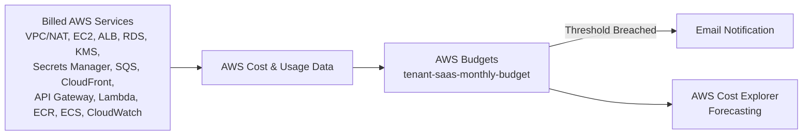

# 🏗️ AWS Billing & Budgets

---

## 📌 Overview

AWS Billing and Cost Management (with **AWS Budgets**) is the native AWS service used to track, control, and alert on account spending. It lets an account owner define a spending threshold, monitor actual and forecasted cost against that threshold, and receive automated notifications as spend approaches or exceeds the configured limit — without deploying any additional infrastructure.

---

## 🎯 Purpose in THIS Project

The **Secure Multi-Tenant SaaS Platform** is an internship/portfolio-scale deployment, so cost governance is a first-class requirement, not an afterthought. AWS Budgets is the single control point used to make sure the combined spend of every other service in this stack — VPC/NAT, EC2, ALB, RDS, KMS, Secrets Manager, SQS, CloudFront, API Gateway, Lambda, ECR, ECS Fargate, and CloudWatch — stays visible and alerts fire before the account is billed unexpectedly.

---

## ✅ Why This Service Was Selected

| Reason | Explanation |
|---|---|
| Native & free | AWS Budgets requires no extra compute or third-party tooling and carries no additional service charge for the budget itself |
| Account-wide visibility | A single budget aggregates cost across every AWS service used by the platform, matching the project's need for one consolidated spend view |
| Threshold-based alerting | Multiple percentage-based thresholds (actual and forecasted) give early warning before the hard monthly cap is reached |
| Fits a fixed-budget constraint | The project has a defined monthly ceiling appropriate for an internship-scale workload, which AWS Budgets is purpose-built to enforce visibility over |

---

## ⚙️ My Implementation

| Attribute | Value |
|---|---|
| Budget Name | `tenant-saas-monthly-budget` |
| Budget Type | Cost budget |
| Budget Amount | `$50.00` |
| Budget Period | Monthly |
| Email Notification | Enabled |
| Cost Explorer | AWS default |
| Currency | USD |
| Status | Active |

### Alert Thresholds

| Threshold | Definition | Current State |
|---|---|---|
| Actual cost > 50% | Fires when actual cost exceeds `$25.00` of the `$50.00` budget | Not exceeded |
| Forecasted cost > 80% | Fires when forecasted cost exceeds `$40.00` of the `$50.00` budget | Not exceeded |
| Actual cost > 80% | Fires when actual cost exceeds `$40.00` of the `$50.00` budget | Not exceeded |
| Actual cost > 100% | Fires when actual cost exceeds `$50.00` of the `$50.00` budget | Not exceeded |

### Configuration Steps Performed

1. Navigated to **Billing and Cost Management Console → Budgets → Create Budget**.
2. Selected budget type **Cost budget**, named it `tenant-saas-monthly-budget`.
3. Set the amount to `$50.00`, period **Monthly**.
4. Added the four alert thresholds listed above (50% actual, 80% forecasted, 80% actual, 100% actual).
5. Enabled email notifications for threshold breaches.

> ⚠️ **Finding:** An independent cost estimate derived from the exact resource sizes configured in this deployment (see the project's Cost Estimation document) puts realistic monthly spend at roughly **3–4× the configured `$50` budget** — driven primarily by the 400 GiB RDS storage allocation, the always-on ECS Fargate task, and the mandatory NAT Gateway. The budget's thresholds are expected to fire early in the first billing cycle unless resource sizing is reduced. AWS Budgets alerts do **not** stop spending automatically — they are a notification mechanism only.

---

## 🔄 Role in End-to-End Request Flow

AWS Budgets sits **outside** the live tenant request path. It does not process, route, or touch any user request. Instead, it operates as a continuous, out-of-band control loop over billing data aggregated from every service that participates in the request flow (CloudFront → API Gateway → ALB → ECS → RDS, plus the asynchronous SQS → Lambda billing pipeline):

---

## 🔗 Communication With Other AWS Services

| Service | Interaction |
|---|---|
| All billed services in this project | Cost and usage data from every provisioned resource rolls up into the budget calculation |
| AWS Cost Explorer | Supplies the forecasting model used for the "forecasted cost > 80%" threshold |
| Email (AWS notification) | Receives threshold-breach alerts; no SNS topic is configured for this budget |

---

## 🔒 Security Implementation

- Access to the Billing and Cost Management console is restricted to the account owner/IAM principals with billing permissions; no additional IAM roles in this project were granted billing access.
- Budget notifications are delivered by email only — no external endpoint or third-party integration is configured, minimizing exposure of cost data.
- No payment or account-level credentials are stored or referenced by the budget configuration itself.

---

## 📈 High Availability & Scalability

AWS Budgets is a fully managed, regional-independent AWS service with no infrastructure for this project to provision, patch, or scale. It automatically re-evaluates cost and forecast data on AWS's standard billing refresh cycle, requiring no capacity planning or availability configuration from this project.

---

## 📊 Monitoring

| Monitoring Aspect | Detail |
|---|---|
| Alert Thresholds | 50% actual, 80% forecasted, 80% actual, 100% actual |
| Notification Channel | Email |
| Forecasting | AWS Cost Explorer forecasting, enabled by default |
| Current Threshold Status | All four thresholds "Not exceeded" as of last review |

> **Best Practice:** Treat the 50/80/100% alerts as an early-warning system rather than a hard spending cap, since AWS Budgets does not stop resource usage on its own.

---

## ✅ Best Practices Implemented

- Multiple graduated alert thresholds (50% actual, 80% forecasted, 80% actual, 100% actual) instead of a single "over budget" trigger.
- Email notifications enabled so threshold breaches are surfaced proactively rather than discovered after the fact.
- Cost Explorer forecasting enabled to catch trend-based overspend before it becomes actual overspend.
- Budget scoped to a single, clearly named resource (`tenant-saas-monthly-budget`) for unambiguous tracking.

---

## ⭐ Why This Service Is Important

For a fixed-budget, internship-scale deployment, AWS Budgets is the only safeguard against unbounded AWS spend across a fifteen-plus-service architecture. Without it, cost visibility would depend entirely on manually checking the Billing console — AWS Budgets automates that check and pushes the alert to the account owner instead.

---

## 📝 Summary

AWS Budgets was configured with a `$50.00` monthly cost budget (`tenant-saas-monthly-budget`) and four graduated alert thresholds with email notifications enabled, giving the Secure Multi-Tenant SaaS Platform continuous, automated visibility into spend across every provisioned AWS service. While correctly configured, the project's own cost analysis flags that actual resource sizing likely exceeds this budget several times over — making the budget's alerts an active, necessary signal rather than a formality.
