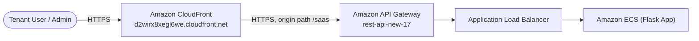

# 🌐 Amazon CloudFront

## 📌 Overview

Amazon CloudFront is the global content delivery network (CDN) and public entry point for this SaaS platform. It fronts the Amazon API Gateway REST API, terminates HTTPS for end users, and forwards every request through to the API layer — giving the platform a single, edge-optimized domain (`d2wirx8xegl6we.cloudfront.net`) that tenants and administrators use to reach the application.

## 🎯 Purpose in THIS Project

In this project, Amazon CloudFront is used to:

- Serve as the **single public HTTPS entry point** for the entire SaaS application.
- **Redirect all HTTP traffic to HTTPS**, ensuring encrypted transport for every tenant request.
- Forward requests to the **Amazon API Gateway** origin (`26qdafcfw9.execute-api.us-east-1.amazonaws.com/saas`), which in turn proxies to the Application Load Balancer.
- Act as the **redirect target** for Amazon Cognito's Hosted UI (`/auth/callback`) and the sign-out URL, tying authentication flows to the same public domain.

## ✅ Why This Service Was Selected

| Requirement | How CloudFront Meets It |
|---|---|
| Single public entry point | One CloudFront domain fronts the API Gateway origin, giving tenants and Cognito a stable, consistent URL |
| HTTPS everywhere | Viewer Protocol Policy redirects HTTP → HTTPS automatically |
| Global performance | "Use all edge locations" price class routes user requests through the nearest AWS edge location |
| Decouples public domain from backend infrastructure | The API Gateway/ALB/ECS backend can change without affecting the tenant-facing domain |

## ⚙️ My Implementation

| Attribute | Value |
|---|---|
| Distribution ID | `E12DONECWSCSS8` |
| Distribution ARN | `arn:aws:cloudfront::629184998332:distribution/E12DONECWSCSS8` |
| Distribution Domain | `d2wirx8xegl6we.cloudfront.net` |
| Origin Name / Domain | `26qdafcfw9.execute-api.us-east-1.amazonaws.com` |
| Origin Type | API Gateway |
| Origin Protocol Policy | HTTPS only |
| Origin Path | `/saas` |
| Origin Request Policy | AllViewerExceptHostHeader |
| Path Pattern | Default (`*`) |
| Viewer Protocol Policy | Redirect HTTP to HTTPS |
| Allowed HTTP Methods | GET, HEAD, OPTIONS, PUT, POST, PATCH, DELETE |
| Cache HTTP Methods | OPTIONS |
| Cache Policy | CachingDisabled |
| Compression | Enabled |
| Price Class | Use all edge locations (best performance) |
| Alternate Domain Name | Not configured |
| SSL Certificate | Default CloudFront certificate |
| Default Root Object | Not configured |
| IPv6 | Enabled |
| WAF | Disabled |
| Logging | Disabled |
| Status | Enabled |

## 🔄 Role in End-to-End Request Flow

Every browser request — whether it is loading the application, calling a REST API endpoint, or completing the Cognito Hosted UI login redirect — passes through CloudFront first. CloudFront redirects any HTTP request to HTTPS, then forwards the request unmodified (via `AllViewerExceptHostHeader`) to the API Gateway origin at path `/saas`, which continues the chain to the ALB and ultimately the ECS-hosted Flask application.

## 🔗 Communication With Other AWS Services

| Service | Interaction |
|---|---|
| Amazon API Gateway | Configured as the sole origin; CloudFront forwards all viewer requests to `26qdafcfw9.execute-api.us-east-1.amazonaws.com/saas` |
| Amazon Cognito | The Cognito App Client's Callback URL, Redirect URL, and Sign-out URL all point to the CloudFront domain, making CloudFront the landing point for the authentication flow |
| Amazon ECS (indirect) | The Flask application's `COGNITO_REDIRECT_URI` and `COGNITO_LOGOUT_REDIRECT_URI` environment variables reference the CloudFront domain, tying the app's auth logic to this distribution |

## 🔒 Security Implementation

- **Viewer Protocol Policy: Redirect HTTP to HTTPS** — no unencrypted traffic reaches the origin.
- **HTTPS-only origin protocol policy** — CloudFront only communicates with API Gateway over HTTPS, never plaintext HTTP.
- **IPv6 enabled**, extending HTTPS enforcement to IPv6 clients as well.
- **Origin request policy `AllViewerExceptHostHeader`** forwards viewer headers to API Gateway (needed for Cognito JWT authorization headers) while stripping the `Host` header to avoid origin routing conflicts.
- **CachingDisabled policy** ensures dynamic, tenant-specific, and authenticated API responses are never cached or served to the wrong tenant.

## 📈 High Availability & Scalability

CloudFront's **"Use all edge locations"** price class routes every tenant request through the AWS edge location nearest to them, minimizing latency globally. As a fully managed CDN, CloudFront automatically absorbs traffic spikes and DDoS-style request volume at the edge before requests ever reach API Gateway, ALB, or ECS — requiring no manual scaling configuration on the project's part.

## 📊 Monitoring

- CloudFront request-level metrics — **Requests**, **4XXErrorRate**, **5XXErrorRate**, and **BytesDownloaded** — are surfaced on the `tenant-saas-app-monitoring` CloudWatch dashboard.
- **Logging is currently disabled** for this distribution; access logs are not being written to S3 in the current configuration.
- **WAF is disabled**, so no web application firewall metrics are available for this distribution.

## ✅ Best Practices Implemented

- ✅ HTTP-to-HTTPS redirection enforced at the edge for every request
- ✅ HTTPS-only communication between CloudFront and its API Gateway origin
- ✅ Caching disabled for a fully dynamic, authenticated API workload to prevent stale or cross-tenant data leakage
- ✅ Compression enabled to reduce payload size and improve response times
- ✅ Global edge distribution via the all-edge-locations price class for consistent worldwide performance

## ⭐ Why This Service Is Important

CloudFront gives the multi-tenant SaaS platform a single, stable, HTTPS-secured public domain that is decoupled from the underlying API Gateway, ALB, and ECS infrastructure. It is also the anchor point for the Cognito authentication flow — every login redirect, callback, and sign-out URL resolves back to the CloudFront domain — making it a critical piece of both the security perimeter and the user-facing identity experience.

## 📝 Summary

Distribution `E12DONECWSCSS8` (`d2wirx8xegl6we.cloudfront.net`) is the global, HTTPS-enforced public entry point for the Secure Multi-Tenant SaaS Platform. It fronts the Amazon API Gateway REST API with caching disabled to preserve request freshness, and it anchors the Cognito Hosted UI's callback, redirect, and sign-out flows — delivering the application to tenants worldwide through AWS's global edge network.
