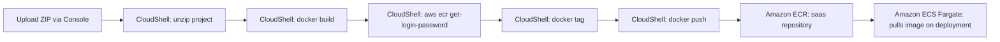

# 🖥️ AWS CloudShell

## 📌 Overview

AWS CloudShell is a browser-based, pre-authenticated shell environment accessible directly from the AWS Management Console. It comes preloaded with the AWS CLI, Docker, Git, and common runtime tools, removing the need to configure a local machine with AWS credentials to run administrative or deployment commands.

In this project, AWS CloudShell was used as the **deployment workstation** to build the Flask application's Docker image and push it to Amazon ECR.

---

## 🎯 Purpose in THIS Project

| Attribute | Value |
|---|---|
| Environment | `us-east-1` environment |
| Region | us-east-1 |
| AWS CLI Version | `aws-cli/2.36.25 Python/3.14.6 Linux/6.1.176-223.369.amzn2023.x86_64 exec-env/CloudShell exe/x86_64.amzn.2023` |
| Docker Version | `Docker version 25.0.14, build 0bab007` |
| Git Version | `git version 2.50.1` |
| Python Version | Python 3.13.14 |
| Status | Active |

---

## ✅ Why This Service Was Selected

- CloudShell provided a **pre-authenticated environment** with AWS credentials already scoped to the account, eliminating the need to configure the AWS CLI locally for the ECR push workflow.
- **Docker was already available** in the CloudShell environment, allowing the application image to be built and pushed without installing container tooling on a local machine.
- Being **browser-based**, CloudShell allowed the project's deployment steps to be executed from anywhere, without depending on a specific local operating system.
- It offered a straightforward way to **upload the project ZIP file** directly through the console UI (Actions → Upload file) and unpack it for the Docker build.

---

## ⚙️ My Implementation

### Setup & File Upload

The application source was uploaded to CloudShell as a ZIP archive using the console's **Actions → Upload file** feature, then extracted and inspected:

```bash
ls
unzip tenant-saas-app-bill.zip
cd tenant-saas-app-bill
cd tenant-saas-app-fixed
ls -la
```

### Docker Build

```bash
docker build -t tenant-saas-app .
```

### Authenticate, Tag, and Push to Amazon ECR

```bash
aws ecr get-login-password --region us-east-1 | docker login --username AWS --password-stdin 629184998332.dkr.ecr.us-east-1.amazonaws.com

docker tag tenant-saas-app:latest 629184998332.dkr.ecr.us-east-1.amazonaws.com/saas:latest

docker push 629184998332.dkr.ecr.us-east-1.amazonaws.com/saas:latest
```

This sequence authenticated the local Docker daemon against the `saas` ECR repository using a temporary token from `aws ecr get-login-password`, re-tagged the locally built image with the full ECR repository URI, and pushed it as `saas:latest`.

---

## 🔄 Role in End-to-End Request Flow



AWS CloudShell does not participate in live application traffic — it is strictly a **build-and-deploy tool** used at deployment time to get the container image from source code into Amazon ECR, from which Amazon ECS Fargate later pulls it.

---

## 🔗 Communication With Other AWS Services

| Service | Interaction |
|---|---|
| **Amazon ECR** | Stored the Docker container images pushed from CloudShell |
| **Amazon ECS** | Used the ECR Docker image (built and pushed via CloudShell) for container deployment |
| **AWS IAM** | CloudShell operated under the authenticated console user's IAM permissions to authenticate with ECR |
| **Docker** | Built and tagged the application container image inside the CloudShell environment |

---

## 🔒 Security Implementation

- **Pre-Authenticated Session**: CloudShell inherits the IAM identity and permissions of the signed-in console user — no separate credential files or access keys were stored on disk.
- **Temporary ECR Login Token**: `aws ecr get-login-password` generates a short-lived authentication token for Docker login rather than using long-lived static credentials.
- **No Persistent Public Exposure**: CloudShell sessions are ephemeral and scoped to the console session, reducing the risk of leftover credentials or artifacts.

---

## 📈 High Availability & Scalability

AWS CloudShell is a fully managed, on-demand environment provisioned by AWS per session — there is no infrastructure to scale or maintain. It was used as a one-time-per-deployment build tool in this project rather than a persistent, highly available service in the request path.

---

## 📊 Monitoring

CloudShell itself is not part of the platform's runtime monitoring stack (it is not included in the `tenant-saas-app-monitoring` dashboard). Its role was limited to command execution during the build-and-push workflow; command output (build logs, push confirmation, image digest) was reviewed directly in the CloudShell terminal at deployment time.

---

## ✅ Best Practices Implemented

- ✅ Used pre-authenticated console credentials instead of managing local AWS access keys
- ✅ Used short-lived ECR login tokens (`aws ecr get-login-password`) instead of static Docker credentials
- ✅ Verified project contents (`ls -la`) before building the Docker image
- ✅ Explicit, repeatable tag-and-push sequence matching the target ECR repository URI

---

## ⭐ Why This Service Is Important

AWS CloudShell served as the **bridge between application source code and the AWS deployment pipeline** for this project. Without it, building and pushing the Docker image to Amazon ECR would have required setting up and securing a local Docker and AWS CLI environment — CloudShell removed that setup overhead entirely.

---

## 📝 Summary

AWS CloudShell was used as a browser-based command-line environment to upload the application ZIP file, build and test the Docker container image, authenticate with Amazon ECR, tag the image, and push it to the `saas` repository for deployment through Amazon ECS.
