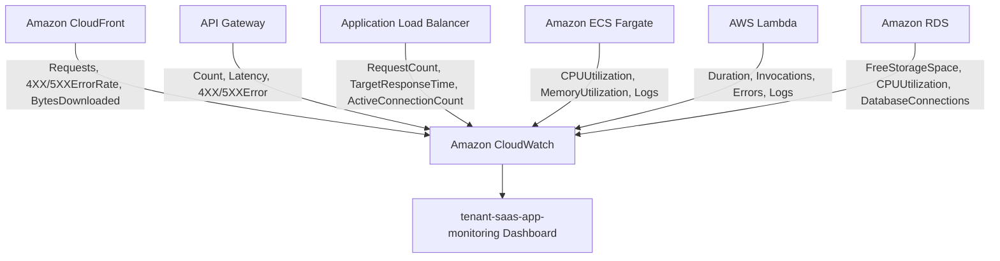

# 📊 Amazon CloudWatch

## 📌 Overview

Amazon CloudWatch is AWS's native monitoring and observability service. It collects metrics, logs, and events from AWS resources and applications, enabling centralized dashboards, log analysis, and operational visibility across an entire architecture.

In this project, Amazon CloudWatch provides the **centralized monitoring and logging layer** for the Secure Multi-Tenant SaaS Platform, through the `tenant-saas-app-monitoring` dashboard and dedicated log groups for ECS and Lambda.

---

## 🎯 Purpose in THIS Project

| Attribute | Value |
|---|---|
| Dashboard Name | `tenant-saas-app-monitoring` |
| Log Groups | `/ecs/saas-task-family-13`, `/aws/lambda/tenant-saas-metering` |
| Log Retention | 30 days |
| Container Insights | Enabled for ECS Fargate cluster (`saas-task-family-13`) |
| Alarms | Not configured |
| SNS Notification | Not configured |
| Status | Active |

---

## ✅ Why This Service Was Selected

- CloudWatch is the **native AWS observability service**, requiring no additional agents or third-party tooling to collect metrics from ECS, Lambda, RDS, ALB, API Gateway, and CloudFront.
- A **single dashboard** consolidating all six services gave a unified operational view of the entire request path, from CDN to database, in one place.
- Native **`awslogs` log driver** support in the ECS task definition made shipping container logs to CloudWatch a configuration setting rather than custom instrumentation.
- Container Insights provided **deeper ECS Fargate visibility** (CPU/Memory utilization) without deploying a separate monitoring agent.

---

## ⚙️ My Implementation

### Dashboard — `tenant-saas-app-monitoring`

| Widget Group | Metrics |
|---|---|
| **Application Load Balancer** | `RequestCount`, `TargetResponseTime`, `ActiveConnectionCount` |
| **Amazon RDS** | `FreeStorageSpace`, `CPUUtilization`, `DatabaseConnections` |
| **Amazon API Gateway** | `Count`, `Latency`, `4XXError`, `5XXError` |
| **Amazon ECS Fargate** | `CPUUtilization`, `MemoryUtilization` |
| **AWS Lambda** | `Duration`, `Invocations`, `Errors` |
| **Amazon CloudFront** | `Requests`, `4XXErrorRate`, `5XXErrorRate`, `BytesDownloaded` |

### Log Groups

| Log Group | Source | Purpose |
|---|---|---|
| `/ecs/saas-task-family-13` | Amazon ECS (Flask application) | Application execution logs, request handling, errors |
| `/aws/lambda/tenant-saas-metering` | AWS Lambda (billing function) | Usage event processing logs, database write confirmations, failures |

- **Log Retention**: Configured to never expire at the log group level, with a 30-day retention policy applied for active operational review.
- **Metric Filters**: None configured.
- **Alarms**: None configured — monitoring in this project is dashboard-driven rather than alarm-driven.

---

## 🔄 Role in End-to-End Request Flow

CloudWatch does not sit in the user-facing request path — it operates **alongside** every other service, continuously collecting metrics and logs that are surfaced on the unified monitoring dashboard for operational visibility.

---

## 🔗 Communication With Other AWS Services

| Service | Interaction |
|---|---|
| **Amazon CloudFront** | Publishes `Requests`, `4XXErrorRate`, `5XXErrorRate`, `BytesDownloaded` metrics |
| **Amazon API Gateway** | Publishes `Count`, `Latency`, `4XXError`, `5XXError` metrics and execution logs |
| **Application Load Balancer** | Publishes `RequestCount`, `TargetResponseTime`, `ActiveConnectionCount` metrics |
| **Amazon ECS Fargate** | Publishes `CPUUtilization`, `MemoryUtilization` metrics; ships container logs to `/ecs/saas-task-family-13` |
| **AWS Lambda** | Publishes `Duration`, `Invocations`, `Errors` metrics; ships function logs to `/aws/lambda/tenant-saas-metering` |
| **Amazon RDS** | Publishes `FreeStorageSpace`, `CPUUtilization`, `DatabaseConnections` metrics |

---

## 🔒 Security Implementation

- **IAM-Scoped Log Delivery**: Log delivery to CloudWatch is authorized through service-specific IAM permissions — `tenant-saas-task-role` and `ecsTaskExecutionRole` include `CloudWatchLogsFullAccess`/log-write permissions for ECS, and the Lambda execution role includes `AWSLambdaBasicExecutionRole` for function logging.
- **No Public Exposure**: Dashboards and log groups are accessible only within the AWS account via IAM-authenticated console/API access — there is no public-facing CloudWatch endpoint.
- **Centralized Visibility**: Consolidating logs and metrics into CloudWatch avoids scattering operational data across service-specific consoles, reducing the chance of an issue going unnoticed.

---

## 📈 High Availability & Scalability

Amazon CloudWatch is a fully managed, regional AWS service that scales automatically to ingest metrics and logs from all monitored resources without any capacity planning required. As the platform's ECS tasks, Lambda invocations, or CloudFront traffic grow, CloudWatch continues to collect and display the corresponding metrics without additional configuration.

---

## 📊 Monitoring

| Category | Detail |
|---|---|
| Dashboard | `tenant-saas-app-monitoring` — single-pane view across ECS, Lambda, RDS, ALB, API Gateway, CloudFront |
| Log Groups | `/ecs/saas-task-family-13`, `/aws/lambda/tenant-saas-metering` |
| Container Insights | Enabled for the ECS Fargate cluster |
| Retention | 30 days |
| Alarms | Not configured (identified as an improvement area) |

**Purpose Summary:**
- **CloudWatch Purpose**: Monitor, collect, and analyze the performance, availability, and health of the AWS SaaS platform resources.
- **Dashboard Purpose**: Provide a centralized view of ECS, Lambda, RDS, ALB, API Gateway, and CloudFront performance metrics for monitoring and troubleshooting.
- **Log Purpose**: Store and analyze application execution logs from `/ecs/saas-task-family-13` and `/aws/lambda/tenant-saas-metering` to troubleshoot errors, track application activity, and verify service operation.

---

## ✅ Best Practices Implemented

- ✅ Single consolidated dashboard across all six major services
- ✅ Dedicated log groups per compute service (ECS, Lambda)
- ✅ Container Insights enabled for deeper ECS Fargate visibility
- ✅ Least-privilege, service-specific IAM permissions for log delivery
- ✅ Defined log retention policy (30 days)

---

## ⭐ Why This Service Is Important

Amazon CloudWatch is the platform's **single pane of glass** for operational health. Without it, diagnosing an issue would require checking each AWS service's console individually — CloudWatch consolidates ECS, Lambda, RDS, ALB, API Gateway, and CloudFront signals into one dashboard and two log groups, making troubleshooting and performance verification significantly faster.

---

## 📝 Summary

Amazon CloudWatch provides centralized monitoring and logging for the Secure Multi-Tenant SaaS Platform through the `tenant-saas-app-monitoring` dashboard, which surfaces metrics from ECS, Lambda, RDS, ALB, API Gateway, and CloudFront, alongside dedicated log groups for the ECS application and the Lambda billing function — giving full visibility into the platform's performance, availability, and health.
