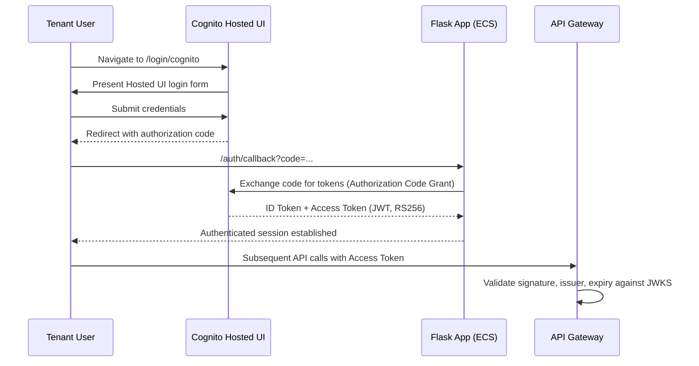

# 🏗️ Amazon Cognito

---

## 📌 Overview

Amazon Cognito is AWS's fully managed identity service, providing user directories (User Pools), a hosted authentication UI, and standards-based OAuth2/OIDC token issuance (JWTs). It allows applications to offload user sign-up, sign-in, and token management to a managed service instead of building custom authentication.

---

## 🎯 Purpose in THIS Project

Amazon Cognito is the **Identity Layer** of the Secure Multi-Tenant SaaS Platform. It authenticates every tenant user through its Hosted UI, issues signed JWTs, and enables **only authenticated users** to reach the platform's REST APIs and protected resources. It is also the mechanism used to model tenant-based access control through Cognito User Groups.

---

## ✅ Why This Service Was Selected

| Reason | Explanation |
|---|---|
| Standards-based | Implements OAuth2 Authorization Code Grant and OIDC, issuing RS256-signed JWTs validated against a published JWKS endpoint |
| Native API Gateway integration | Amazon API Gateway can attach a Cognito User Pool authorizer directly, validating tokens at the edge before any request reaches the ALB/ECS tier |
| Hosted UI | Provides a ready-made, managed login experience without building and securing custom login pages |
| Group-based multi-tenancy | Cognito User Groups (`TenantA_admin`, `TenantA_user`, `TenantB_admin`, `TenantB_user`) map directly onto the platform's multi-tenant, role-based access model |
| Fully managed | No servers, patching, or scaling to manage for the identity layer |

---

## ⚙️ My Implementation

### User Pool Configuration

| Attribute | Value |
|---|---|
| User Pool Name | `<COGNITO_USER_POOL_NAME>` |
| User Pool ID | `<COGNITO_USER_POOL_ID>` |
| Region | `us-east-1` |
| Application Type | Single-Page Application (SPA) |
| App Client Name | `saas-SPA-cognito-12` |
| App Client ID | `<COGNITO_APP_CLIENT_ID>` |
| Cognito Domain | `<COGNITO_DOMAIN>` |
| Branding Version | Managed login |
| Sign-in Identifiers | Email, Username |
| MFA | Not enabled |
| Custom Attributes | None |

### Password Policy

The application enforces a minimum password length of **8 characters**. Passwords must contain at least one number, one special character, one uppercase letter, and one lowercase letter. Temporary passwords generated by administrators expire after **7 days**, and password reuse follows the configured Cognito policy.

### App Client / OAuth Configuration

| Attribute | Value |
|---|---|
| Callback URL | `<CLOUDFRONT_DOMAIN>/auth/callback` |
| Redirect URL | `<CLOUDFRONT_DOMAIN>/auth/callback` |
| Sign-out URL | `<CLOUDFRONT_DOMAIN>/` |
| OAuth Flow | Authorization Code Grant |
| OAuth Scopes | `openid`, `email`, `profile`, `aws.cognito.signin.user.admin` |
| Identity Providers | Cognito user pool |
| Authentication Flows | Choice-based sign-in, Secure Remote Password (SRP), get user tokens from existing authenticated sessions |
| Required Attributes | Email, Name |

### Tenant User Groups

| Group | Role |
|---|---|
| `TenantA_admin` | Tenant A administrator |
| `TenantA_user` | Tenant A standard user |
| `TenantB_admin` | Tenant B administrator |
| `TenantB_user` | Tenant B standard user |

### JWT / Token Configuration

| Attribute | Value |
|---|---|
| Token Types | ID Token and Access Token |
| Token Format | JWT |
| Signing Algorithm | RS256 |
| Token Issuer | `https://cognito-idp.us-east-1.amazonaws.com/<COGNITO_USER_POOL_ID>` |
| JWKS Endpoint | `<COGNITO_JWKS_URL>` |
| Token Validation | Signature, issuer, expiration, and token-use claims |
| Token Use | ID Token for user identity; Access Token for authorization |
| Refresh Token | Used to obtain new access and ID tokens |

Status: **Running**

---

## 🔄 Role in End-to-End Request Flow

Cognito governs the authentication flow that precedes every protected API call:

Once a token is issued, every subsequent call to a protected route (`/api/v1/users/*`, `/api/v1/admin/*`, `/api/v1/billing/*`) carries the Access Token, which API Gateway validates against Cognito's published JWKS before forwarding the request to the ALB → ECS tier.

---

## 🔗 Communication With Other AWS Services

| Service | Interaction |
|---|---|
| Amazon API Gateway | Uses a Cognito User Pool authorizer to validate JWTs (signature, issuer, expiry) against the JWKS endpoint before proxying to the ALB |
| Amazon ECS (Flask App) | Exchanges the authorization code for tokens via the Authorization Code Grant flow (`/auth/callback`) and reads Cognito configuration from environment variables (`COGNITO_APP_CLIENT_ID`, `COGNITO_DOMAIN`, `COGNITO_LOGOUT_REDIRECT_URI`, `COGNITO_REDIRECT_URI`, `COGNITO_REGION`, `COGNITO_USER_POOL_ID`) |
| Amazon CloudFront | The Hosted UI's callback, redirect, and sign-out URLs all point back to the CloudFront distribution domain fronting the application |
| IAM | The ECS task role and other application-facing roles are granted the `AmazonCognitoPowerUser` managed policy to interact with the User Pool |

---

## 🔒 Security Implementation

- **RS256-signed JWTs** issued via the Authorization Code Grant flow (rather than the less secure Implicit Grant), with tokens validated against Cognito's published JWKS endpoint.
- **JWT validation is centralized at API Gateway**, so unauthenticated or tampered requests never reach the ALB/ECS application tier.
- **Enforced password policy**: 8-character minimum, requires uppercase, lowercase, number, and special character; temporary admin-issued passwords expire after 7 days.
- **Scoped OAuth scopes** (`openid`, `email`, `profile`, `aws.cognito.signin.user.admin`) limit what the issued tokens can be used for.
- **Tenant isolation via User Groups**, allowing the application to enforce role-based access control per tenant (`TenantA_admin`/`TenantA_user`, `TenantB_admin`/`TenantB_user`).

> ⚠️ **Finding:** Multi-Factor Authentication (MFA) is **not currently enabled** for any user group. This is a known gap — MFA should be required at minimum for the `TenantA_admin` and `TenantB_admin` groups to reduce the risk of compromised admin credentials.

---

## 📈 High Availability & Scalability

Amazon Cognito is a fully managed, regional AWS service with no servers or capacity to provision for this project. It automatically scales to handle authentication traffic and requires no High Availability configuration, Auto Scaling policy, or manual capacity planning from the platform team.

---

## 📊 Monitoring

The project's CloudWatch dashboard (`tenant-saas-app-monitoring`) is scoped to ECS, Lambda, RDS, ALB, API Gateway, and CloudFront performance metrics — **Cognito is not currently included as a dedicated dashboard widget or log group** in this deployment. Authentication health is instead verified operationally: a successful Hosted UI login redirecting to `/auth/callback` with a valid authorization code, and a token exchange that returns a JWT verifying correctly against the published JWKS endpoint.

| Monitoring Aspect | Detail |
|---|---|
| Dashboard Coverage | Not included in `tenant-saas-app-monitoring` |
| Operational Validation | Hosted UI login → `/auth/callback` → JWT verified against JWKS |
| Downstream Signal | `401 Unauthorized` responses at API Gateway indicate a missing, expired, or invalid JWT, or a misconfigured authorizer |

---

## ✅ Best Practices Implemented

- Authorization Code Grant flow used instead of the Implicit Grant, keeping tokens out of the browser URL.
- JWT signature algorithm restricted to RS256 with validation against the published JWKS endpoint.
- Enforced strong password policy with expiring temporary passwords.
- Tenant and role separation modeled through dedicated Cognito User Groups rather than application-side role flags alone.
- Centralized token validation at API Gateway, keeping the ECS application tier isolated from unauthenticated traffic.

---

## ⭐ Why This Service Is Important

Amazon Cognito is the security boundary for the entire platform: it is the only service standing between an anonymous request and the tenant-scoped data behind the API. Because tenant isolation in this project is enforced through Cognito User Groups, Cognito is not just an authentication convenience — it is the mechanism that keeps Tenant A's users and Tenant B's users logically separated within a single shared application deployment.

---

## 📝 Summary

Amazon Cognito was configured as a Single-Page Application User Pool (`saas-SPA-cognito-12`) using the Authorization Code Grant flow, RS256-signed JWTs, an enforced password policy, and four tenant-scoped User Groups. It integrates directly with API Gateway's JWT authorizer to gate access to every protected route, and with CloudFront/ECS for the Hosted UI login redirect cycle. The one identified gap — MFA not enabled for admin groups — is documented as an open recommendation rather than an implemented control.
