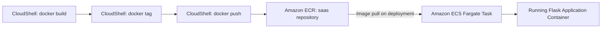

# 📦 Amazon ECR

## 📌 Overview

Amazon Elastic Container Registry (ECR) is a fully managed Docker container registry that makes it easy to store, manage, and deploy container images. It integrates natively with Amazon ECS and AWS IAM for secure image storage and retrieval.

In this project, Amazon ECR hosts the **`saas`** repository, which stores the Docker container image of the Flask-based SaaS application deployed to Amazon ECS Fargate.

---

## 🎯 Purpose in THIS Project

| Attribute | Value |
|---|---|
| Repository Name | `saas` |
| Repository URI | `629184998332.dkr.ecr.us-east-1.amazonaws.com/saas` |
| Repository ARN | `arn:aws:ecr:us-east-1:629184998332:repository/saas` |
| Repository Type | Private |
| Region | us-east-1 |
| Image Tag Mutability | Mutable |
| Encryption Type | AWS KMS |
| Scan Type | Basic |
| Scan Frequency | Manual |
| Scan on Push | Disabled |
| Lifecycle Policy | No lifecycle policy |
| Repository Policy | Default (no custom repository policy) |
| Image Tag | `latest` |
| Image Size | 144.02 MB |
| Image Digest | `sha256:a896f96aca8c642c542458a32e768d19926962b673922398bb0ca96ca121e56a` |
| Status | Active |

The `saas` repository is the sole source of the application container image consumed by the `saas-task-family-13` ECS task definition.

---

## ✅ Why This Service Was Selected

- Amazon ECS Fargate requires container images to be pulled from a registry, and ECR provides **native, IAM-integrated image storage** with no additional infrastructure to manage.
- **Private repository** access ensures the Flask application image is never publicly accessible.
- **KMS encryption at rest** keeps the stored image consistent with the rest of the platform's encryption posture (RDS, Secrets Manager).
- Direct integration with **AWS CloudShell** allowed the image to be built, tagged, and pushed entirely from the browser-based CLI environment used for this project, without a separate CI/CD pipeline.

---

## ⚙️ My Implementation

### Repository Configuration

- **Repository Name**: `saas`, created as a **private** repository in `us-east-1`.
- **Image Tag Mutability**: Set to Mutable, allowing the `latest` tag to be overwritten on each new deployment push.
- **Encryption**: AWS KMS encryption applied to stored images.
- **Scanning**: Basic scan type configured for manual, on-demand vulnerability scanning (scan-on-push disabled).

### Image Push Workflow (executed from AWS CloudShell)

```bash
aws ecr get-login-password --region us-east-1 | docker login --username AWS --password-stdin 629184998332.dkr.ecr.us-east-1.amazonaws.com

docker tag tenant-saas-app:latest 629184998332.dkr.ecr.us-east-1.amazonaws.com/saas:latest

docker push 629184998332.dkr.ecr.us-east-1.amazonaws.com/saas:latest
```

The application was built locally into the `tenant-saas-app` image (via `docker build -t tenant-saas-app .` inside CloudShell), authenticated against ECR using the AWS CLI-generated login token, tagged with the repository URI, and pushed as `saas:latest`.

---

## 🔄 Role in End-to-End Request Flow



Amazon ECR does not sit in the live user request path — instead, it is the **deployment-time artifact store**. Every time the Amazon ECS service starts or replaces a task, `ecsTaskExecutionRole` pulls the `saas:latest` image from this repository to launch the container.

---

## 🔗 Communication With Other AWS Services

| Service | Interaction |
|---|---|
| **AWS CloudShell** | Used to build the Docker image, authenticate to ECR, tag, and push it |
| **Amazon ECS** | `ecsTaskExecutionRole` pulls the `saas:latest` image from this repository when starting Fargate tasks |
| **AWS KMS** | Encrypts container images stored in the repository at rest |
| **AWS IAM** | Controls which roles/users are permitted to push and pull images from the repository |

---

## 🔒 Security Implementation

- **Private Repository**: The `saas` repository is not publicly accessible; only authenticated AWS principals within the account can push or pull images.
- **KMS Encryption at Rest**: Container images are encrypted using AWS KMS.
- **IAM-Based Access Control**: Image pull is restricted to the `ecsTaskExecutionRole`, following least-privilege access for the ECS service.
- **Default Repository Policy**: No custom repository policy is applied, keeping access scoped to the AWS account's own IAM principals rather than cross-account access.

---

## 📈 High Availability & Scalability

- Amazon ECR is a regional, fully managed service with built-in high availability across multiple Availability Zones — no additional configuration is required for durability.
- The registry scales automatically to serve image pull requests as Amazon ECS scales tasks, without any provisioning on my part.

---

## 📊 Monitoring

Image-level visibility for this project is handled through:

| Aspect | Detail |
|---|---|
| Image Size | 144.02 MB — tracked to keep the container lightweight |
| Image Digest | `sha256:a896f96aca8c642c542458a32e768d19926962b673922398bb0ca96ca121e56a` — used to verify the exact image running in ECS |
| Scan Status | Manual, basic scanning available on demand |

---

## ✅ Best Practices Implemented

- ✅ Private repository — no public image exposure
- ✅ KMS encryption at rest for stored container images
- ✅ IAM-scoped pull access limited to `ecsTaskExecutionRole`
- ✅ Consistent image tagging (`latest`) matched to the ECS task definition's container image reference

---

## ⭐ Why This Service Is Important

Amazon ECR is the **single source of truth for the application's runtime container image**. Without it, there would be no secure, versioned, IAM-controlled location from which Amazon ECS Fargate could reliably retrieve the Flask application image for every task launch and deployment.

---

## 📝 Summary

The `saas` Amazon ECR repository stores the Docker container image of the Flask-based SaaS application, built and pushed from AWS CloudShell. It provides the centralized, KMS-encrypted, private image store from which Amazon ECS securely retrieves the application image during task deployment and updates.
