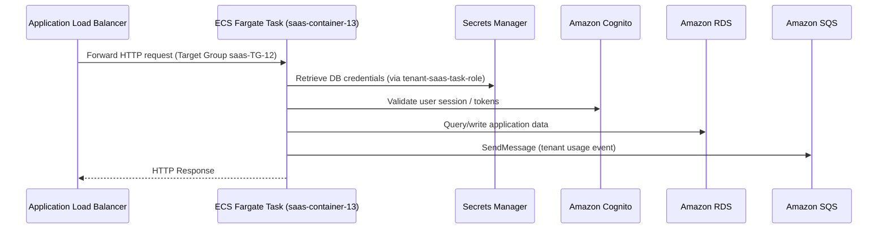

# 🐳 Amazon ECS Fargate

## 📌 Overview

Amazon Elastic Container Service (ECS) is a fully managed container orchestration service. Running on the **AWS Fargate** launch type removes the need to provision or manage the underlying EC2 servers — AWS manages the compute infrastructure and only the containerized workload needs to be defined.

In this project, Amazon ECS Fargate runs the containerized **Flask application** that powers the Secure Multi-Tenant SaaS Platform, behind the Application Load Balancer.

---

## 🎯 Purpose in THIS Project

| Attribute | Value |
|---|---|
| Cluster Name | `saas-cluster-13` |
| Cluster ARN | `arn:aws:ecs:us-east-1:629184998332:cluster/saas-cluster-13` |
| Launch Type | AWS Fargate |
| Task Definition | `saas-task-family-13` (revision `:17`) |
| Task Role | `tenant-saas-task-role` |
| Execution Role | `ecsTaskExecutionRole` |
| Task Size | 1 vCPU / 3 GB memory |
| Service Name | `saas-task-family-20-service` |
| Scheduling Strategy | Replica |
| Desired / Running Tasks | 1 / 1 |
| Deployment Status | Success |
| Container Name | `saas-container-13` |
| Container Image | `629184998332.dkr.ecr.us-east-1.amazonaws.com/saas:latest` |
| Container Port | 8080 (TCP, HTTP) |
| Memory Hard/Soft Limit | 3 GB / 1 GB |
| VPC / Subnet | `saas-VPC-12` / `saas-private-sub2-ECS-aza` |
| Security Group | `sg-0a895aeb74947a534` (ECS-SG-12) |
| Load Balancer | `saas-ALB-12` → Target Group `saas-TG-12` |
| Platform | LINUX, LATEST |
| Status | Active |

---

## ✅ Why This Service Was Selected

- The Flask application was already containerized, making **ECS Fargate** a natural fit for running it without managing EC2 instances or patching an underlying cluster OS.
- **Fargate's serverless container model** matched the project's need to focus on application architecture rather than infrastructure management.
- Native integration with the **Application Load Balancer**, **Amazon ECR**, **AWS Secrets Manager**, and **Amazon CloudWatch Logs** allowed the container to be deployed with minimal custom glue code.
- Running the task in a **private subnet** (`saas-private-sub2-ECS-aza`) kept the application container off the public internet, reachable only through the ALB.

---

## ⚙️ My Implementation

### Cluster & Task Definition

- **Cluster**: `saas-cluster-13`, using AWS Fargate as the sole launch type (no capacity provider strategy configured).
- **Task Definition**: `saas-task-family-13:17`, with:
  - **Task Role**: `tenant-saas-task-role` — grants runtime AWS permissions to the application code (Cognito, KMS, CloudWatch Logs, Secrets Manager, SQS `SendMessage`).
  - **Execution Role**: `ecsTaskExecutionRole` — grants ECS the permissions needed to pull the container image and write logs (`AmazonECSTaskExecutionRolePolicy`).
  - **Task Size**: 1 vCPU, 3 GB memory.

### Container Definition

| Setting | Value |
|---|---|
| Container Name | `saas-container-13` |
| Image | ECR repository image — `629184998332.dkr.ecr.us-east-1.amazonaws.com/saas:latest` |
| Container Port | 8080 (protocol: TCP, port name: `cont-port`) |
| Memory Hard Limit | 3 GB |
| Memory Soft Limit | 1 GB |

### Environment Variables

The container is configured with application, Cognito, database, and messaging environment variables, including:

| Category | Keys |
|---|---|
| **AWS / Region** | `AWS_REGION` |
| **Cognito** | `COGNITO_APP_CLIENT_ID`, `COGNITO_DOMAIN`, `COGNITO_LOGOUT_REDIRECT_URI`, `COGNITO_REDIRECT_URI`, `COGNITO_REGION`, `COGNITO_USER_POOL_ID` |
| **Database** | `RDS_DB_NAME`, `RDS_HOST`, `RDS_PORT`, `SECRETS_MANAGER_SECRET_NAME` |
| **Application** | `FLASK_ENV`, `FLASK_DEBUG`, `FLASK_SECRET_KEY`, `DEMO_MODE`, `LOG_LEVEL`, `LOG_GROUP_NAME` |
| **Security** | `KMS_KEY_ID`, `SESSION_COOKIE_SECURE`, `SESSION_TTL_MINUTES` |
| **Messaging** | `USAGE_EVENTS_QUEUE_URL`, `USAGE_METERING_ENABLED`, `USAGE_PUBLISH_TIMEOUT_SECONDS` |

### Logging Configuration

```
Log Driver         : awslogs
awslogs-group       : /ecs/saas-task-family-13
awslogs-create-group: true
awslogs-region       : us-east-1
awslogs-stream-prefix: ecs
```

### Service Configuration

- **Service Name**: `saas-task-family-20-service`, using the `saas-task-family-13:17` task definition revision.
- **Scheduling Strategy**: Replica, Desired Tasks = 1, Running Tasks = 1.
- **Networking**: Deployed into `saas-private-sub2-ECS-aza`, protected by `ECS-SG-12`.
- **Load Balancing**: Registered with target group `saas-TG-12` behind `saas-ALB-12`.
- **Availability Zone Rebalancing**: Turned on.
- **ECS Managed Tags**: Turned on.

---

## 🔄 Role in End-to-End Request Flow



Amazon ECS Fargate is the **application compute layer** — every authenticated request that passes through API Gateway and the ALB is ultimately handled by the Flask application running inside this Fargate task.

---

## 🔗 Communication With Other AWS Services

| Service | Interaction |
|---|---|
| **Amazon ECR** | Source of the `saas:latest` container image, pulled via `ecsTaskExecutionRole` |
| **Application Load Balancer** | Routes incoming HTTP traffic to the ECS task through target group `saas-TG-12` |
| **AWS Secrets Manager** | `tenant-saas-task-role` retrieves database credentials (`saas-secret-rds-12`) |
| **AWS KMS** | Decrypts secrets retrieved from Secrets Manager |
| **Amazon Cognito** | Validates authenticated user sessions and tokens for protected routes |
| **Amazon RDS** | Application reads/writes tenant data over the private subnet |
| **Amazon SQS** | Publishes tenant usage events to `tenant-saas-usage` for asynchronous billing |
| **Amazon CloudWatch** | Container logs written to `/ecs/saas-task-family-13`; CPU/Memory utilization tracked on the monitoring dashboard |

---

## 🔒 Security Implementation

- **Private Subnet Deployment**: The ECS task runs in `saas-private-sub2-ECS-aza`, with no public IP, reachable only through the ALB.
- **Security Group Chaining**: `ECS-SG-12` accepts traffic only from `ALB-SG-12`, and only initiates outbound traffic to `RDS-SG-12` and other approved destinations, per the platform's chained trust model.
- **Least-Privilege IAM Separation**: The **Task Role** (`tenant-saas-task-role`) governs what the application code can do at runtime, while the **Execution Role** (`ecsTaskExecutionRole`) governs only what ECS itself can do (image pull, log write) — separating application permissions from infrastructure permissions.
- **Secrets via Secrets Manager**: Database credentials are retrieved securely at runtime rather than baked into the container image (though `DB_PASSWORD` and `FLASK_SECRET_KEY` are also present as plaintext task-definition environment variables, a known hardening item tracked in the project's security review).
- **HTTPS-Terminated Traffic**: All inbound traffic to the container arrives already routed through CloudFront, API Gateway, and the ALB, rather than being exposed directly to the internet.

---

## 📈 High Availability & Scalability

- **AWS Fargate** launch type removes the operational burden of patching or scaling underlying EC2 hosts — AWS manages the compute capacity for each task.
- **Availability Zone re-balancing** is turned on for the service, allowing ECS to redistribute tasks across AZs as needed.
- The **ECS Service** construct continuously monitors the desired task count (1) against running task count, automatically replacing any failed task to maintain availability.
- Target group health checks via the ALB ensure only healthy ECS tasks receive traffic.

---

## 📊 Monitoring

| Metric | Purpose |
|---|---|
| `CPUUtilization` | Tracks container CPU usage against the 1 vCPU allocation |
| `MemoryUtilization` | Tracks container memory usage against the 3 GB hard limit |

- **Container Insights**: Enabled for the ECS Fargate cluster.
- **Log Group**: `/ecs/saas-task-family-13`, retained per the platform's log retention policy and surfaced in the `tenant-saas-app-monitoring` dashboard.

---

## ✅ Best Practices Implemented

- ✅ Serverless Fargate launch type — no EC2 host management
- ✅ Private subnet deployment with no public IP assignment
- ✅ Clear separation between Task Role and Execution Role (least privilege)
- ✅ Application secrets retrieved from Secrets Manager at runtime
- ✅ Centralized logging to CloudWatch via the `awslogs` driver
- ✅ Load-balanced deployment behind ALB target group health checks
- ✅ Container Insights enabled for deeper cluster-level visibility

---

## ⭐ Why This Service Is Important

Amazon ECS Fargate is the **core application runtime** of the entire platform. It hosts the Flask application that authenticates users, serves tenant dashboards, manages admin operations, and publishes billing events — making it the central compute component that every other service (ALB, Cognito, RDS, Secrets Manager, SQS) exists to support.

---

## 📝 Summary

Amazon ECS Fargate runs the containerized Flask application for the Secure Multi-Tenant SaaS Platform inside a private subnet, behind the Application Load Balancer. Using the `saas-task-family-13` task definition and the `saas` ECR image, it securely integrates with Secrets Manager, Cognito, RDS, and SQS through a clean separation of Task Role and Execution Role, while streaming logs and metrics to Amazon CloudWatch.
