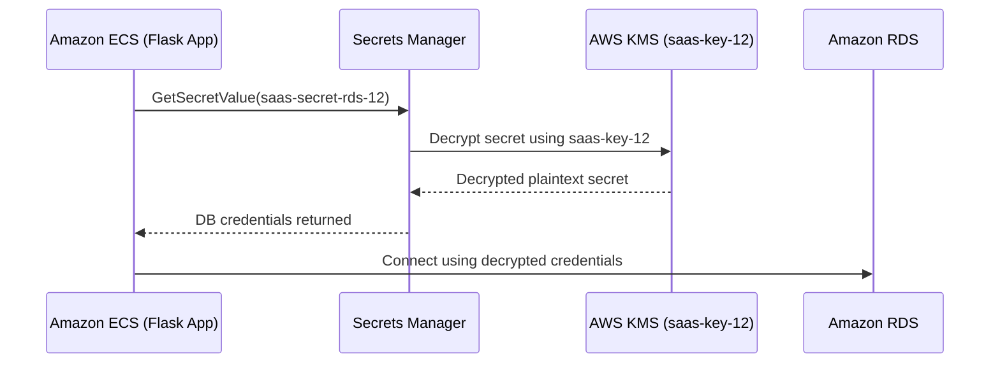

# 🔑 AWS Key Management Service (KMS)

## 📌 Overview

AWS Key Management Service (KMS) is the centralized encryption key management service used in this project to create, control, and audit the cryptographic key that protects sensitive data across the Secure Multi-Tenant SaaS Platform. In this implementation, a single **customer-managed symmetric key** — `saas-key-12` — is the root of trust for encrypting secrets, database credentials, and other sensitive material handled by the platform's compute and data services.

## 🎯 Purpose in THIS Project

In this project, AWS KMS is used to:

- Encrypt and decrypt the **AWS Secrets Manager** secret (`saas-secret-rds-12`) that stores the RDS database credentials and the Flask application secret key.
- Allow the **Amazon ECS** task (via `tenant-saas-task-role`) to decrypt secrets at runtime so the Flask application can connect to the database.
- Allow the **AWS Lambda billing function** (`tenant-saas-metering`) to decrypt the same secret when it connects to RDS to write usage/billing records.
- Serve as the encryption key referenced in the ECS container's `KMS_KEY_ID` environment variable, making key usage explicit and traceable at the application layer.

## ✅ Why This Service Was Selected

| Requirement | How KMS Meets It |
|---|---|
| Centralized, auditable encryption | A single customer-managed key (CMK) controls encryption for secrets instead of scattering keys across services |
| Fine-grained access control | Key policy restricts `kms:Decrypt` / `kms:DescribeKey` to a specific IAM role (`tenant-saas-task-role`) rather than all principals |
| Native integration | KMS integrates directly with AWS Secrets Manager and Amazon RDS without any custom encryption code |
| Ownership over AWS-managed keys | A customer-managed key gives full control over the key policy, unlike the default AWS-managed key |

## ⚙️ My Implementation

| Attribute | Value |
|---|---|
| Key Alias | `saas-key-12` |
| Key ID | `6c0c7b96-7824-4024-b118-04955f2339ed` |
| Key ARN | `arn:aws:kms:us-east-1:629184998332:key/6c0c7b96-7824-4024-b118-04955f2339ed` |
| Key Type | Symmetric |
| Key Manager | Customer-managed key |
| Origin | AWS_KMS |
| Key Rotation | Disabled |
| Key Usage | Encrypt and Decrypt |
| Region | us-east-1 |
| Status | Enabled |

**Services referencing this key:**
- AWS Secrets Manager (`saas-secret-rds-12` encryption key)
- Amazon RDS (storage encryption, where configured)
- Amazon ECS (via task role for runtime decrypt)
- AWS Lambda — Billing function (via metering role for runtime decrypt)

**Key Policy (as configured):**

```json
{
  "Version": "2012-10-17",
  "Id": "key-consolepolicy-3",
  "Statement": [
    {
      "Sid": "Enable IAM User Permissions",
      "Effect": "Allow",
      "Principal": { "AWS": "arn:aws:iam::629184998332:root" },
      "Action": "kms:*",
      "Resource": "*"
    },
    {
      "Sid": "Allow ECS Task Role To Use KMS Key",
      "Effect": "Allow",
      "Principal": { "AWS": "arn:aws:iam::629184998332:role/tenant-saas-task-role" },
      "Action": ["kms:Decrypt", "kms:DescribeKey"],
      "Resource": "*"
    }
  ]
}
```

> ⚠️ **Note:** The key policy explicitly grants decrypt access to `tenant-saas-task-role` only. Any other principal, including the Lambda metering role, relies on its attached IAM policy (`KMS-tenant-12` inline policy on the task role, and IAM permissions on the Lambda side) rather than a dedicated key-policy statement — this is documented as-is from the configuration.

## 🔄 Role in End-to-End Request Flow



KMS does not sit directly in the user-facing request path. It is invoked **behind the scenes** every time the ECS Flask application or the Lambda billing function retrieves the database secret from Secrets Manager — the KMS key transparently decrypts the secret value before it is handed back to the calling service.

## 🔗 Communication With Other AWS Services

| Service | Interaction |
|---|---|
| AWS Secrets Manager | Encrypts/decrypts the `saas-secret-rds-12` secret using `saas-key-12` |
| Amazon RDS | Uses `saas-key-12` for storage encryption when the database was provisioned with this CMK |
| Amazon ECS | `tenant-saas-task-role` calls `kms:Decrypt` / `kms:DescribeKey` at runtime to read secrets |
| AWS Lambda (Billing) | `tenant-saas-metering-role-xwtl8bom` decrypts the secret to obtain DB credentials before connecting to RDS |
| AWS IAM | Inline policy `KMS-tenant-12` on `tenant-saas-task-role` grants `kms:Encrypt`, `kms:Decrypt`, `kms:GenerateDataKey` scoped to this key's ARN |

## 🔒 Security Implementation

- **Customer-managed key**, not the AWS-managed default, giving full control over the key policy and access boundaries.
- **Principal-scoped key policy**: only the ECS task role is explicitly granted `kms:Decrypt` and `kms:DescribeKey` in the key policy.
- **Resource-scoped IAM policy**: the `KMS-tenant-12` inline policy restricts `kms:Encrypt`, `kms:Decrypt`, and `kms:GenerateDataKey` to the exact key ARN, not `Resource: "*"`.
- **No plaintext credentials in code**: application secrets are never hardcoded; they are decrypted on demand through Secrets Manager + KMS.
- **Symmetric key algorithm**, appropriate for envelope encryption of secrets and RDS storage without requiring key exchange logic in the application.

## 📈 High Availability & Scalability

AWS KMS is a fully managed, regional service with built-in high availability across multiple Availability Zones in `us-east-1`. No capacity planning, patching, or scaling configuration is required from the project side — key operations (`Encrypt`, `Decrypt`, `DescribeKey`) scale automatically with the number of Secrets Manager and RDS calls made by ECS and Lambda.

## 📊 Monitoring

- Key usage (Encrypt/Decrypt/DescribeKey calls) is tracked implicitly through the calling services (Secrets Manager, RDS, ECS, Lambda) rather than through a dedicated CloudWatch dashboard widget for KMS in this project.
- Key status is monitored manually via the KMS console (`Enabled` state, key rotation status).

## ✅ Best Practices Implemented

- ✅ Customer-managed key instead of relying solely on AWS-managed keys
- ✅ Key policy scoped to a specific IAM role rather than open to all principals
- ✅ Inline IAM policy scoped to the exact key ARN, not wildcarded
- ✅ Symmetric key used for straightforward encrypt/decrypt operations required by Secrets Manager and RDS
- ✅ Key never exposed to application code — access happens only through Secrets Manager's managed decrypt flow

## ⭐ Why This Service Is Important

KMS is the **root of trust** for every secret used by this platform. Without it, database credentials and the Flask session secret would either need to be stored in plaintext or encrypted using ad-hoc, unmanaged mechanisms. By centralizing encryption under one auditable, IAM-controlled key, the project ensures that only explicitly authorized ECS and Lambda roles can ever recover the plaintext credentials — directly supporting the platform's defense-in-depth security posture for a multi-tenant environment.

## 📝 Summary

AWS KMS provides the customer-managed encryption key (`saas-key-12`) that underpins secret protection across this project. It is tightly integrated with AWS Secrets Manager to protect RDS credentials and the Flask secret key, and its use is restricted through both a key policy and a scoped IAM inline policy to the ECS task role and Lambda billing role — ensuring that sensitive data is never accessible outside of the explicitly authorized runtime services.
