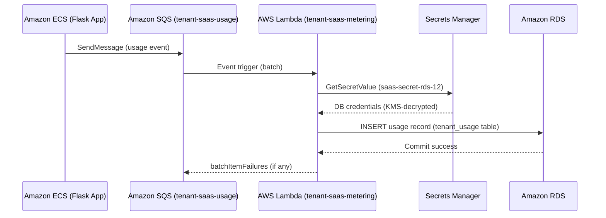

# ⚡ AWS Lambda

## 📌 Overview

AWS Lambda is a serverless compute service that runs code in response to events without requiring you to provision or manage servers. It automatically scales with the number of incoming events and only charges for the compute time consumed.

In this project, AWS Lambda hosts the **`tenant-saas-metering`** function, which asynchronously processes tenant usage events and writes billing records to the Amazon RDS database.

---

## 🎯 Purpose in THIS Project

| Attribute | Value |
|---|---|
| Function Name | `tenant-saas-metering` |
| Function ARN | `arn:aws:lambda:us-east-1:629184998332:function:tenant-saas-metering` |
| Package Type | Zip |
| Runtime | Python 3.14 |
| Handler | `lambda_function.lambda_handler` |
| Memory | 128 MB |
| Ephemeral Storage | 512 MB |
| Timeout | 0 min 15 sec |
| Architecture | x86_64 |
| Layer | `tenant-saas-pymysql` (Version 1) |
| Execution Role | `tenant-saas-metering-role-xwtl8bom` |
| Region | us-east-1 |
| VPC | `vpc-03c620f18f61ea855` (saas-VPC-12) |
| Subnets | `saas-private-sub2-ECS-aza`, `saas-private-sub1-RDS-aza` |
| Security Group | `sg-080f0b92c37b76dca` (saas-LAMBDA-billing-SG) |
| Trigger | Amazon SQS — `tenant-saas-usage` (Enabled) |
| Status | Running |

The function is deployed as a **private-subnet, VPC-attached Lambda**, with no inbound network rules — it only initiates outbound connections to AWS Secrets Manager and Amazon RDS.

---

## ✅ Why This Service Was Selected

- Usage/billing events needed to be processed **asynchronously and independently** of the Flask request/response cycle running on Amazon ECS.
- Lambda's native **Amazon SQS trigger** made it possible to consume `tenant-saas-usage` queue messages automatically, in batches, without polling infrastructure.
- Serverless execution meant billing compute only runs — and only incurs cost — when there are actual usage events to process, which suited a low-traffic internship-scale workload.
- Lambda **Layers** allowed the `pymysql` dependency to be packaged separately from the function code, keeping the deployment artifact small and reusable.
- Partial batch failure reporting (`batchItemFailures`) let failed messages be retried by SQS without reprocessing successfully handled events.

---

## ⚙️ My Implementation

### Function Configuration

- **Runtime**: Python 3.14, `x86_64` architecture, 128 MB memory, 512 MB ephemeral storage, 15-second timeout.
- **Layer**: `tenant-saas-pymysql:1`, providing the `pymysql` MySQL driver used to connect to Amazon RDS.
- **VPC Attachment**: Deployed into `saas-private-sub2-ECS-aza` and `saas-private-sub1-RDS-aza`, using security group `saas-LAMBDA-billing-SG`, so the function can reach RDS without traversing the public internet.
- **Trigger**: Amazon SQS queue `tenant-saas-usage` (`arn:aws:sqs:us-east-1:629184998332:tenant-saas-usage`), state Enabled.

### Function Logic (`lambda_function.py`)

```python
DB_SECRET_NAME = os.environ["DB_SECRET_NAME"]
AWS_REGION = os.environ.get("AWS_REGION", "ap-south-1")

secrets_client = boto3.client("secretsmanager", region_name=AWS_REGION)

def get_db_credentials():
    global db_credentials
    if db_credentials is None:
        response = secrets_client.get_secret_value(SecretId=DB_SECRET_NAME)
        db_credentials = json.loads(response["SecretString"])
    return db_credentials

def get_db_connection():
    credentials = get_db_credentials()
    return pymysql.connect(
        host=credentials["host"],
        user=credentials["db_username"],
        password=credentials["db_password"],
        database=credentials.get("database", "saas_database"),
        port=int(credentials.get("port", 3306)),
        connect_timeout=10,
        read_timeout=10,
        write_timeout=10,
        autocommit=False,
        cursorclass=pymysql.cursors.DictCursor
    )
```

**Processing flow inside `lambda_handler`:**

1. Iterate over each SQS record in `event["Records"]`.
2. Parse the message body as JSON and validate required fields: `event_id`, `tenant_id`, `user_id`, `action`, `api_path`, `http_method`, `status_code`, `usage_units`.
3. Call `insert_usage_record(data)`, which opens a MySQL connection (via cached Secrets Manager credentials) and inserts the record into the `tenant_usage` table using an `INSERT ... ON DUPLICATE KEY UPDATE` statement for idempotency.
4. On success, log `"Usage event processed: <event_id>"`.
5. On failure, log the exception and add the message ID to `batchItemFailures`, so only the failed message is retried by SQS — not the entire batch.

```python
sql = """
    INSERT INTO tenant_usage (
        event_id, tenant_id, user_id, action, api_path,
        http_method, status_code, usage_units, created_at
    )
    VALUES (%s, %s, %s, %s, %s, %s, %s, %s, %s)
    ON DUPLICATE KEY UPDATE event_id = event_id
"""
```

---

## 🔄 Role in End-to-End Request Flow



The Flask application running on Amazon ECS publishes a usage event to the `tenant-saas-usage` SQS queue for every metered action; Lambda then consumes that event, resolves database credentials securely, and persists the billing record — completely decoupled from the user-facing request path.

---

## 🔗 Communication With Other AWS Services

| Service | Interaction |
|---|---|
| **Amazon SQS** | `tenant-saas-usage` queue triggers the function with batches of usage events |
| **AWS Secrets Manager** | `GetSecretValue` on `saas-secret-rds-12` retrieves RDS credentials, using the `secrets-lambda-policy` inline policy |
| **AWS KMS** | `kms:Decrypt` permission (scoped) decrypts the Secrets Manager secret retrieved by the function |
| **Amazon RDS** | Lambda inserts processed billing records into the `tenant_usage` table over the private subnet |
| **Amazon CloudWatch** | Function logs are written to `/aws/lambda/tenant-saas-metering`; Duration, Invocations, and Errors are tracked on the monitoring dashboard |

---

## 🔒 Security Implementation

- **Execution Role Scoping**: `tenant-saas-metering-role-xwtl8bom` grants only `AWSLambdaVPCAccessExecutionRole`, plus inline policies `secrets-lambda-policy` (scoped to the single `saas-secret-rds-12` secret ARN) and `sqs-lambda-policy` (scoped SQS consume actions).
- **No Inbound Network Access**: The function has no inbound security group rules — it only makes outbound calls, minimizing its network attack surface.
- **VPC Isolation**: Deployed in the same private subnets as RDS, so database traffic never traverses the public internet.
- **Secrets Never Hardcoded**: Database credentials are retrieved at runtime from Secrets Manager and cached in memory only for the life of the execution environment, rather than stored in function code or environment variables.
- **KMS-Backed Secret Decryption**: The secret retrieved from Secrets Manager is decrypted using the customer-managed KMS key, and the Lambda role is explicitly granted `kms:Decrypt` for that key.

---

## 📈 High Availability & Scalability

- AWS Lambda automatically scales the number of concurrent executions to match the volume of messages available in the `tenant-saas-usage` SQS queue.
- Batch item failure reporting ensures that a single malformed usage event does not block processing of the rest of the batch or cause redundant reprocessing of already-succeeded records.
- The 15-second timeout and lightweight 128 MB memory allocation are sized appropriately for a short-lived, single-record database write operation.

---

## 📊 Monitoring

| Metric | Purpose |
|---|---|
| `Duration` | Time taken to process each invocation (secret retrieval + DB insert) |
| `Invocations` | Number of times the function has been triggered by SQS |
| `Errors` | Count of failed invocations, surfaced for troubleshooting |

Logs are collected in the **`/aws/lambda/tenant-saas-metering`** CloudWatch Log Group and included in the `tenant-saas-app-monitoring` dashboard.

---

## ✅ Best Practices Implemented

- ✅ Event-driven, decoupled architecture using SQS as the trigger source
- ✅ Least-privilege IAM execution role scoped to specific secret and queue ARNs
- ✅ Dependency isolation using a Lambda Layer (`tenant-saas-pymysql`)
- ✅ Credential caching within the execution context to reduce Secrets Manager calls
- ✅ Partial batch failure handling to prevent reprocessing of successful records
- ✅ VPC-attached deployment with no inbound rules

---

## ⭐ Why This Service Is Important

AWS Lambda is what makes the platform's **billing and usage-metering pipeline asynchronous and resilient**. By offloading usage processing from the Flask application to an event-driven function, the platform avoids blocking user-facing requests on database writes, and gains automatic retry semantics for failed billing events through the SQS + Lambda batch failure mechanism.

---

## 📝 Summary

The `tenant-saas-metering` AWS Lambda function is the serverless billing engine of the Secure Multi-Tenant SaaS Platform. Triggered by Amazon SQS, it securely retrieves database credentials from Secrets Manager (decrypted via KMS), and persists tenant usage records into Amazon RDS — enabling automated, asynchronous, and scalable usage metering entirely decoupled from the core application.
