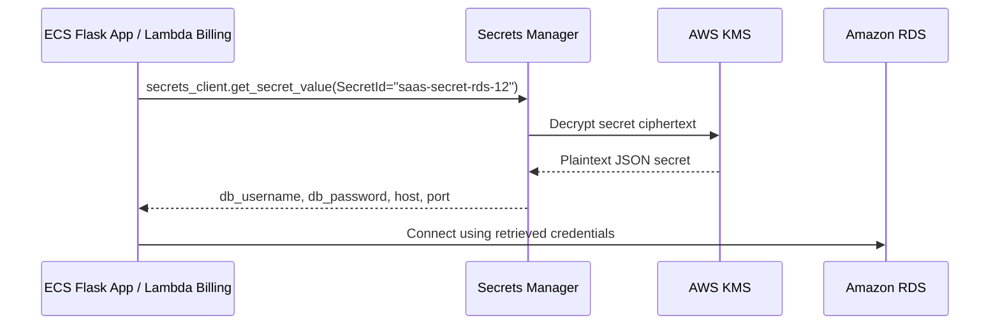

# 🔐 AWS Secrets Manager

## 📌 Overview

AWS Secrets Manager is used in this project to securely store and serve the Amazon RDS database credentials and the Flask application secret key. Instead of embedding sensitive values in source code or container images, the platform's ECS task and Lambda billing function retrieve them at runtime through a single, KMS-encrypted secret: `saas-secret-rds-12`.

## 🎯 Purpose in THIS Project

In this project, Secrets Manager is used to:

- Securely hold the **RDS MySQL credentials** (`db_username`, `db_password`, `host`, `port`, `engine`, `dbInstanceIdentifier`) needed by the Flask application and the billing Lambda to connect to `saas-database`.
- Store the **`FLASK_SECRET_KEY`**, used by the Flask application for session and cookie signing.
- Allow both the **ECS-hosted Flask app** and the **Lambda billing function** to retrieve credentials dynamically at runtime instead of hardcoding them.

## ✅ Why This Service Was Selected

| Requirement | How Secrets Manager Meets It |
|---|---|
| No hardcoded credentials | Secrets are retrieved via API call at runtime, not baked into the Docker image or Lambda package |
| Encryption at rest | The secret is encrypted using the customer-managed KMS key `saas-key-12` |
| Centralized secret for multiple consumers | Both ECS and Lambda read from the same secret, avoiding credential duplication/drift |
| IAM-controlled access | Only roles with explicit `secretsmanager:GetSecretValue` permission can read the secret |

## ⚙️ My Implementation

| Attribute | Value |
|---|---|
| Secret Name | `saas-secret-rds-12` |
| Secret ARN | `arn:aws:secretsmanager:us-east-1:629184998332:secret:saas-secret-rds-12-ljuwBe` |
| Region | us-east-1 |
| Encryption Key | `saas-key-12` (customer-managed KMS key) |
| Rotation | Disabled |
| Status | Enabled |

**Stored Credentials:**

| Secret Key | Description |
|---|---|
| `db_username` | RDS master username (`admin`) |
| `db_password` | RDS master password |
| `engine` | Database engine (`mysql`) |
| `host` | RDS endpoint (`saas-database.cspc2k48alh9.us-east-1.rds.amazonaws.com`) |
| `port` | RDS port (`3306`) |
| `dbInstanceIdentifier` | RDS instance identifier (`saas-database`) |
| `FLASK_SECRET_KEY` | Flask session/cookie signing key |

**Access Permissions:**

| Role | Access |
|---|---|
| `tenant-saas-task-role` (ECS Task Role) | Reads DB credentials for the Flask application |
| `tenant-saas-metering-role-xwtl8bom` (Lambda Billing Role) | Reads DB credentials for the billing/metering function |
| `ecsTaskExecutionRole` | Retrieves secrets during ECS task startup (if secrets injection is configured at the task-definition level) |

**Consumers:** Amazon ECS (Flask application) and AWS Lambda (Billing Function).

## 🔄 Role in End-to-End Request Flow

Both the ECS Flask application and the `tenant-saas-metering` Lambda function call `get_secret_value(SecretId=DB_SECRET_NAME)` at startup, caching the credentials in memory to avoid repeated API calls, then use them to open a MySQL connection to `saas-database`.

## 🔗 Communication With Other AWS Services

| Service | Interaction |
|---|---|
| AWS KMS | Encrypts and decrypts the secret using `saas-key-12` |
| Amazon ECS | Task role reads the secret to connect the Flask app to RDS |
| AWS Lambda | Metering role reads the same secret (via `DB_SECRET_NAME` environment variable) to connect to RDS |
| Amazon RDS | Destination database that the retrieved credentials authenticate against |
| AWS IAM | `SecretsManagerReadWrite` managed policy and inline `secrets-lambda-policy` control which roles can read the secret |

## 🔒 Security Implementation

- **Encryption at rest** using a customer-managed KMS key rather than the AWS-default Secrets Manager key.
- **No credentials in source code or container image** — the secret is fetched via the AWS SDK at runtime.
- **Role-based access**: only `tenant-saas-task-role` and `tenant-saas-metering-role-xwtl8bom` are permitted to call `GetSecretValue`.
- **Single source of truth**: one secret serves both consuming services, preventing credential drift between the application and billing tiers.
- **In-memory caching** in application code (`db_credentials` global) minimizes repeated Secrets Manager calls per Lambda invocation without persisting the secret to disk.

## 📈 High Availability & Scalability

Secrets Manager is a fully managed, regional service that automatically replicates and serves secrets with high availability across `us-east-1`. No infrastructure provisioning is required, and secret retrieval scales automatically with the number of ECS tasks or Lambda invocations reading the secret.

## 📊 Monitoring

- Secret access is implicitly observable through **CloudWatch Logs** emitted by the consuming ECS tasks and the `tenant-saas-metering` Lambda function (log groups `/ecs/saas-task-family-13` and `/aws/lambda/tenant-saas-metering`).
- No automatic rotation or dedicated CloudWatch alarm is configured for this secret in the current implementation.

## ✅ Best Practices Implemented

- ✅ Credentials retrieved at runtime instead of hardcoded in the application or Docker image
- ✅ Secret encrypted with a customer-managed KMS key
- ✅ Access restricted to only the two IAM roles that require it
- ✅ Single shared secret to avoid credential duplication across ECS and Lambda
- ✅ Application-level caching to reduce redundant API calls

## ⭐ Why This Service Is Important

Secrets Manager removes the need to ever place database credentials or the Flask secret key in plaintext configuration files, environment definitions checked into version control, or container images. In a multi-tenant SaaS platform where the same database backs every tenant's data, protecting the credential path is critical — Secrets Manager, backed by KMS encryption, ensures that only explicitly authorized compute services (ECS, Lambda) can ever recover those credentials.

## 📝 Summary

`saas-secret-rds-12` centralizes the RDS database credentials and Flask secret key used across this project, encrypted with the customer-managed `saas-key-12` KMS key. Both the ECS-hosted Flask application and the `tenant-saas-metering` Lambda function retrieve this secret at runtime via IAM-controlled access, eliminating hardcoded credentials and keeping the database connection path secure end to end.
