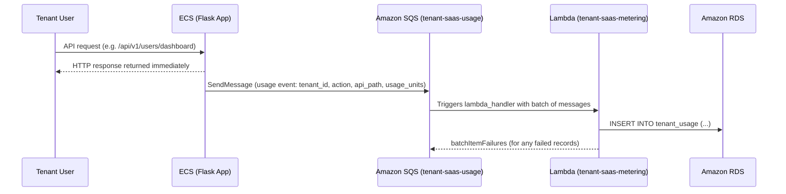

# 📨 Amazon Simple Queue Service (SQS)

## 📌 Overview

Amazon SQS is used in this project as the asynchronous messaging layer that decouples the ECS-hosted Flask application from the billing/metering Lambda function. Tenant usage events generated by the application are placed on a Standard queue, `tenant-saas-usage`, and consumed asynchronously by the `tenant-saas-metering` Lambda function.

## 🎯 Purpose in THIS Project

In this project, Amazon SQS is used to:

- Receive **tenant usage events** published by the ECS Flask application (API calls, actions performed by tenants).
- **Decouple** the request-serving application tier from the billing/metering processing tier so that usage tracking never blocks or slows down user-facing API responses.
- **Trigger** the `tenant-saas-metering` Lambda function automatically whenever a new usage message arrives.
- Provide a durable buffer so usage events are not lost if the billing Lambda is briefly unavailable or under load.

## ✅ Why This Service Was Selected

| Requirement | How SQS Meets It |
|---|---|
| Asynchronous processing | The Flask app publishes usage events without waiting for billing processing to complete |
| Decoupling | The application tier (ECS) and billing tier (Lambda) can scale and fail independently |
| Reliable delivery | Standard queue with 4-day retention ensures messages are not lost before Lambda processes them |
| Native Lambda integration | SQS can trigger Lambda directly as an event source, without custom polling code |

## ⚙️ My Implementation

| Attribute | Value |
|---|---|
| Queue Name | `tenant-saas-usage` |
| Queue URL | `https://sqs.us-east-1.amazonaws.com/629184998332/tenant-saas-usage` |
| Queue ARN | `arn:aws:sqs:us-east-1:629184998332:tenant-saas-usage` |
| Queue Type | Standard |
| Region | us-east-1 |
| Encryption | Amazon SQS-managed key (SSE-SQS) |
| Visibility Timeout | 1 minute |
| Message Retention | 4 days |
| Maximum Message Size | 1024 KiB |
| Delivery Delay | 0 seconds |
| Receive Wait Time | 0 seconds (short polling) |
| Dead Letter Queue | Disabled |
| Redrive Policy | Not configured |
| Status | Running |

**Access Policy:**

```json
{
  "Version": "2012-10-17",
  "Id": "__default_policy_ID",
  "Statement": [
    {
      "Sid": "__owner_statement",
      "Effect": "Allow",
      "Principal": { "AWS": "arn:aws:iam::629184998332:root" },
      "Action": "SQS:*",
      "Resource": "arn:aws:sqs:us-east-1:629184998332:tenant-saas-usage"
    }
  ]
}
```

- **Producer:** Amazon ECS (Flask application) — sends usage events via `sqs:SendMessage`.
- **Consumer:** AWS Lambda (`tenant-saas-metering`) — configured as an SQS-triggered event source with **Enabled** state.

## 🔄 Role in End-to-End Request Flow



The application publishes a usage event to SQS **after** responding to the tenant, so billing/metering never adds latency to the user-facing request path. Amazon SQS then invokes the Lambda function asynchronously, which persists the usage record into the `tenant_usage` table in RDS.

## 🔗 Communication With Other AWS Services

| Service | Interaction |
|---|---|
| Amazon ECS | Publishes usage events to the queue using `sqs:SendMessage` (permitted via the `sqs-policy` inline IAM policy on `tenant-saas-task-role`) |
| AWS Lambda | `tenant-saas-metering` is configured with an SQS trigger on `tenant-saas-usage`, processing messages in batches |
| AWS IAM | `sqs-policy` (ECS task role) scopes `sqs:SendMessage` to this queue's ARN only; `sqs-lambda-policy` grants the Lambda role permission to poll and delete messages |
| Amazon RDS | Indirect consumer — usage data extracted from SQS messages is ultimately written to the `tenant_usage` table |

## 🔒 Security Implementation

- **Encryption at rest** via SSE-SQS (Amazon SQS-managed encryption key) protecting message content while queued.
- **Least-privilege IAM**: the ECS task role can only `sqs:SendMessage` to this specific queue ARN via the `sqs-policy` inline policy — not queue-wide administrative actions.
- **Batch failure handling**: the Lambda consumer returns `batchItemFailures` for any message that fails processing, so only failed messages are retried rather than the entire batch.
- **Account-scoped access policy**: the queue's resource policy restricts access to principals within the same AWS account (`629184998332`).

## 📈 High Availability & Scalability

Amazon SQS is a fully managed, highly available queuing service that automatically distributes messages across multiple servers within `us-east-1`. As a Standard queue, it provides at-least-once delivery and virtually unlimited throughput, allowing the platform to absorb usage-event spikes from the ECS application without any manual capacity planning. The Lambda consumer scales its concurrency automatically based on the number of messages available in the queue.

## 📊 Monitoring

- SQS activity is observed indirectly through **Amazon CloudWatch**, where the `tenant-saas-metering` Lambda's `Invocations`, `Errors`, and `Duration` metrics reflect queue-driven processing.
- Application and Lambda logs (`/ecs/saas-task-family-13`, `/aws/lambda/tenant-saas-metering`) capture publish and consume events for troubleshooting.
- No dead-letter queue or CloudWatch alarms are currently configured for this queue.

## ✅ Best Practices Implemented

- ✅ Asynchronous decoupling between the application tier and the billing tier
- ✅ Least-privilege `SendMessage`-only permission granted to the ECS task role
- ✅ Encryption at rest enabled by default (SSE-SQS)
- ✅ Batch item failure reporting from Lambda so only failed messages are retried
- ✅ Standard queue chosen to prioritize throughput and scale over strict ordering, matching the nature of usage-metering events

## ⭐ Why This Service Is Important

In a multi-tenant SaaS platform, usage metering and billing must never block or slow down the tenant-facing API. Amazon SQS is the mechanism that makes this possible — it lets the Flask application "fire and forget" usage events while the billing pipeline processes them independently and reliably. This decoupling also means the ECS application tier and the Lambda billing tier can be scaled, deployed, and troubleshot independently of one another.

## 📝 Summary

The `tenant-saas-usage` Standard SQS queue is the asynchronous backbone connecting the ECS-hosted Flask application to the Lambda-based billing/metering pipeline. It decouples user-facing request handling from usage tracking, buffers events with a 4-day retention window, and reliably triggers the `tenant-saas-metering` Lambda function to persist billing data into Amazon RDS — all governed by least-privilege IAM permissions on both the producer and consumer sides.
