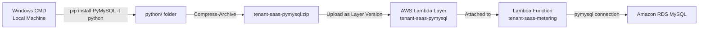

# 🏗️ Windows CMD (Lambda Package Preparation)

---

## 📌 Overview

Windows Command Prompt (CMD) is the local, native command-line environment on Windows used here as a **build-time tool** rather than a deployed AWS resource. It was used to assemble a Python dependency package (`PyMySQL`) into the ZIP format required by an AWS Lambda Layer.

---

## 🎯 Purpose in THIS Project

The `tenant-saas-metering` Lambda function connects to Amazon RDS MySQL using the `pymysql` Python library, which is **not included** in the standard AWS Lambda Python runtime. Windows CMD was used on a local machine to install `PyMySQL` into the folder structure AWS Lambda Layers require, and to compress that structure into a deployable ZIP archive — `tenant-saas-pymysql.zip`.

---

## ✅ Why This Service Was Selected

| Reason | Explanation |
|---|---|
| Native to the local machine | No additional build tooling, container, or CI system was required for a single-dependency package |
| Matches Lambda Layer conventions | The Lambda Layer folder convention (`python/`) is straightforward to produce with `mkdir` and `pip install -t` from any Windows shell |
| Direct control over the package | Building locally made it easy to verify the exact contents of the ZIP before uploading it as a Layer version |

---

## ⚙️ My Implementation

### Local Environment

| Attribute | Value |
|---|---|
| Environment | Local Computer Command Prompt (Windows CMD) |
| Operating System | Windows |
| Command Version | Microsoft Windows [Version 10.0.26200.8655] |
| Python Version | Python 3.13.14 |
| PIP Version | pip 26.1.2 |
| Installed Package | `PyMySQL` |
| Project Folder | `tenant-saas-pymysql` |
| File Created | `tenant-saas-pymysql.zip` |

### Commands Executed

```cmd
mkdir C:\Users\acer\tenant-saas-pymysql
cd C:\Users\acer\tenant-saas-pymysql
python --version
mkdir python
python -m pip install PyMySQL -t python
powershell Compress-Archive -Path python -DestinationPath tenant-saas-pymysql.zip
dir
```

1. Created a dedicated project folder (`tenant-saas-pymysql`) to isolate the Layer build.
2. Verified the local Python version before installing dependencies.
3. Created the `python/` subfolder — the exact folder name AWS Lambda expects at the root of a Python Layer ZIP.
4. Installed `PyMySQL` directly into `python/` using `pip install -t`, targeting the Layer folder instead of the system site-packages.
5. Used PowerShell's `Compress-Archive` (invoked from CMD) to produce `tenant-saas-pymysql.zip`.
6. Listed the folder contents (`dir`) to confirm the ZIP was created successfully before upload.

**Status:** Successfully created the Lambda deployment package for SaaS billing and usage metering.

---

## 🔄 Role in End-to-End Request Flow

This step does **not** participate in any live request path. It is a **build-time, pre-deployment activity** that produces an artifact consumed once the Lambda function is invoked at runtime:



Once the Layer is attached, every subsequent invocation of `tenant-saas-metering` — triggered by the SQS `tenant-saas-usage` queue — can `import pymysql` without the module being packaged inside the function's own deployment ZIP.

---

## 🔗 Communication With Other AWS Services

| Service | Interaction |
|---|---|
| AWS Lambda | The ZIP produced locally is uploaded as a new Lambda Layer version (`tenant-saas-pymysql`, v1) and attached to the `tenant-saas-metering` function |
| Amazon RDS (MySQL) | The `PyMySQL` library packaged by this process is what allows the Lambda function to open a database connection to RDS at runtime |

---

## 🔒 Security Implementation

- The ZIP package contains only the `PyMySQL` library and its dependencies — no credentials, connection strings, or secrets are bundled into the Layer.
- Database credentials remain externalized to AWS Secrets Manager and are retrieved by the Lambda function at runtime, never embedded in the locally built package.
- The package is built for the same runtime architecture (x86_64) as the target Lambda function, avoiding a mismatched-architecture import failure at invocation time.

---

## 📈 High Availability & Scalability

Not applicable in the traditional sense — Windows CMD is a local, one-time (or as-needed) build tool, not a running AWS resource. The **output** of this process, the Lambda Layer, is versioned and stored durably by AWS Lambda and is reused automatically across every warm and cold start of the `tenant-saas-metering` function without needing to be rebuilt.

---

## 📊 Monitoring

There is no direct monitoring of the local CMD build step itself. Its correctness is instead verified indirectly through the Lambda function it supports:

| Monitoring Aspect | Detail |
|---|---|
| Success Signal | CloudWatch Logs for `/aws/lambda/tenant-saas-metering` show `Usage event processed` |
| Failure Signal | Import errors for `pymysql` in the same log group indicate the Layer was not attached, or was built for the wrong architecture |

---

## ✅ Best Practices Implemented

- Dependencies installed directly into the Lambda-expected `python/` folder structure rather than a generic folder, avoiding layer path errors.
- Package built for the correct target architecture (x86_64) to match the Lambda function configuration.
- Verified folder contents (`dir`) before compressing and uploading, reducing the chance of shipping an incomplete Layer.
- Kept the Layer scoped to a single dependency (`PyMySQL`), keeping the artifact small and easy to reason about.

---

## ⭐ Why This Service Is Important

Without this packaging step, the `tenant-saas-metering` Lambda function would fail immediately on `import pymysql`, breaking the entire asynchronous billing pipeline (SQS → Lambda → RDS). This local build process is a small but essential prerequisite that makes the project's usage-metering and billing feature possible.

---

## 📝 Summary

Windows CMD was used locally to install `PyMySQL` into a Lambda-Layer-compatible folder structure and compress it into `tenant-saas-pymysql.zip` using PowerShell's `Compress-Archive`. The resulting ZIP was uploaded as a Lambda Layer version and attached to the `tenant-saas-metering` function, giving it the database connectivity library required to persist tenant usage records to Amazon RDS MySQL as part of the platform's asynchronous billing pipeline.
